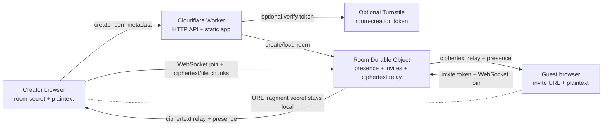

# Threat Model

## Assets

- room capability URL
- room secret in the fragment
- derived room encryption key
- peer session IDs
- encrypted transcript and files held by connected clients
- creator destroy capability and one-time invites

## Security Goal

Minimize what the server can read and retain, so the application can be used with lower central trust than a store-and-forward chat service. Content is end-to-end encrypted; the server relays ciphertext and never persists messages or files.

## System Boundary

The server-side boundary is intentional: the Worker and Durable Object can enforce room lifecycle, invite state, capacity, and transport rules, but they do not receive the room secret or readable message/file content in normal operation. The browsers are the only components that derive the room key and handle plaintext.

## Trust Assumptions

- browsers provide correct Web Crypto implementations
- users verify and protect capability links out of band
- connected participants are not automatically trusted with plaintext once they decrypt
- the Worker / Durable Object is honest-but-curious: it relays and coordinates, but is not trusted with content

## Primary Threats

### Link leakage

Anyone with the full capability URL can derive the room key and (with a valid invite or the creator token) participate.

Current mitigations:

- room secret stays in the URL fragment and is not sent in normal HTTP requests
- strict `Referrer-Policy: no-referrer`
- one-time invites for non-creators; creator can revoke invites and remove participants
- no third-party analytics on room pages; hosted first-party growth counters are aggregate-only and documented in the README

### Server compromise or insider access

The relay can see connection metadata and ciphertext, but not plaintext.

Current mitigations:

- all message and file content is end-to-end encrypted in the browser
- no server-side transcript or file persistence (only room metadata and invites are stored)
- the room secret never reaches the server

Residual risk:

- the server **does relay ciphertext**, so it observes message/file timing, sizes, and participant presence
- an attacker with full server control could perform traffic analysis on this metadata

### Peer IP exposure

Because content is relayed (not sent peer-to-peer), participants never connect directly, so **no room member learns another member's IP address**. This is a deliberate advantage over a naive WebRTC design, where ICE negotiation would reveal peer IPs to everyone in the room. Cloudflare's edge still sees each client's IP, as with any hosted service.

### Peer compromise

Any connected participant can exfiltrate plaintext after local decryption. Not solved by this design:

- screenshots
- copy / paste
- malicious local extensions
- infected devices

### Transcript loss

Because the server does not persist messages, transcript continuity depends on connected clients retaining encrypted history in memory. If no connected participant still has a message, it cannot be recovered. This is intentional for ephemerality, and a usability trade-off.

### Traffic analysis

An adversary observing the relay or network can infer room activity, presence, and message/file bursts without decrypting content. Not solved in the current implementation: timing obfuscation, padding, cover traffic.

### Availability / abuse

Optional invisible Turnstile on room creation limits automated room-creation spam. There is no per-message rate limiting or DoS protection beyond room capacity and expiry.

## Non-Goals In Current Build

- strong anonymous routing (metadata hiding from the relay)
- deniable messaging
- authenticated human identity
- forward secrecy beyond a shared static room key
- verified peer device trust
- authenticated sender identity (text protocol v2 authenticates to the shared room key, but ephemeral identity keys are not used to verify which participant sent it)

## High-Risk Use Warning

This design is E2E encrypted and ephemeral, but it is not sufficient to claim strong protection for people under severe repression. A production-safe deployment for high-risk users would still need:

- independent review of text protocol v2, plus file-event authentication and replay protection across refresh
- stronger peer/device trust model
- traffic-analysis resistance
- denial-of-service handling
- clear user education about participant trust and device compromise
