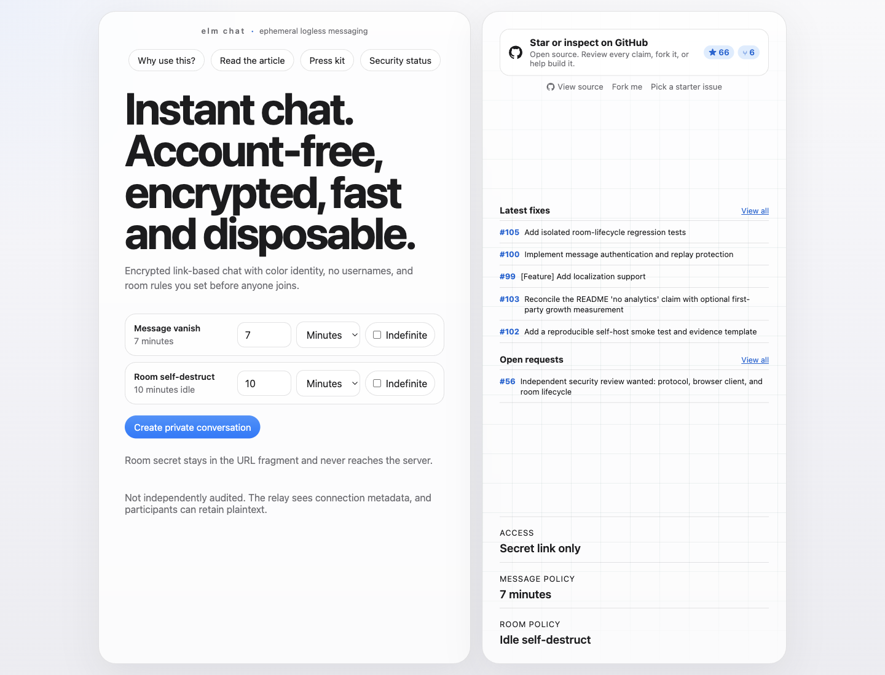
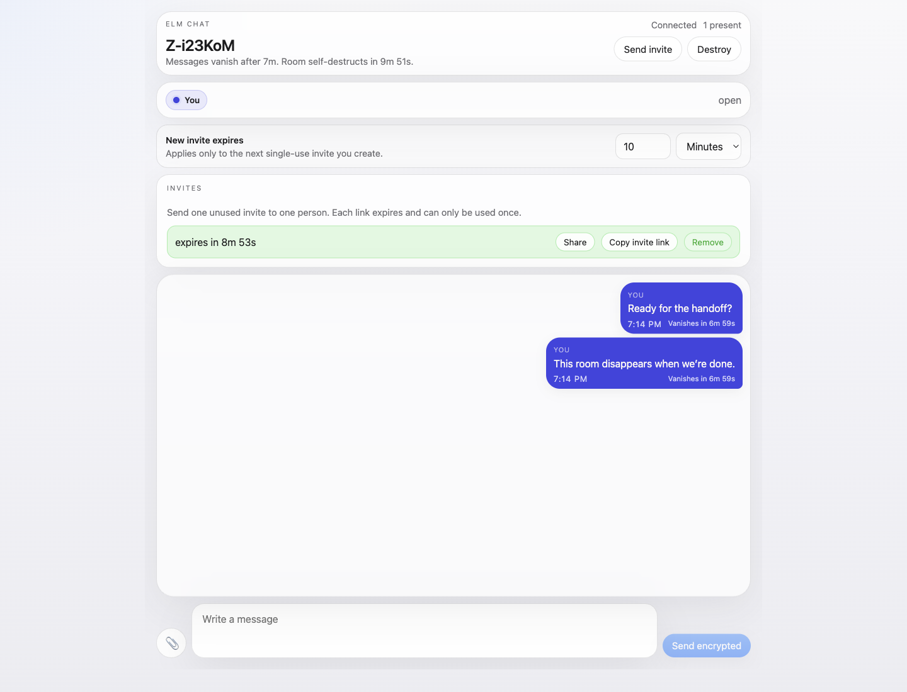

# Why Temporary Conversations Need Clear Privacy Boundaries

Most people do not start by asking for cryptography.

They start with a much simpler need:

They need to complete a short exchange without creating another permanent server-side transcript.

That might be a temporary troubleshooting session, a low-risk credential handoff, a file exchange, or event coordination between people who already know one another. The durable outcome can be recorded where it belongs without preserving every transient message.

That is the practical case for a disposable room.

## The Problem Is Bigger Than Message Encryption

Many apps promise privacy because the content is encrypted. That is a good start, but it is not the whole problem.

People are also exposed by:

- permanent account identity
- central message archives
- searchable history
- server logs
- analytics trails
- attachment retention
- metadata that reveals who talked, when they talked, and how often

In the real world, bad actors do not always need the plain text of a conversation to cause harm. They may only need access to a server, a partner account, a leaked backup, a hostile insider, a compelled platform, or a timeline of who connected to whom.

For any system, those boundaries should be stated plainly instead of hidden behind a broad “private” claim.

## Why Someone Would Choose elm.chat

`elm.chat` is built around a simple idea:

Some conversations should not create a server-side message archive.

Not every message needs an account.
Not every room needs a permanent home.
Not every conversation should be indexed, backed up, synced forever, and made retrievable by anyone who later gains access.

`elm.chat` is for moments where people want something lighter, faster, and safer:

- a room you can open instantly
- a one-time invite you can issue for one person
- no usernames
- no social graph
- no inbox full of old exposure
- messages that vanish
- rooms that self-destruct

The point is not novelty. The point is reducing what can be collected, retained, stolen, or used against people later.

## The Human Use Cases

This kind of tool is useful for ordinary privacy-minded people.

It is intended for ordinary, low-risk conversations between people who already know and trust one another. It is not an anonymity system, a whistleblower drop box, a regulated-data channel, or a tool for people facing a high-risk adversary. The project is early-stage and has not completed an independent security audit.

The useful question is narrower: “Which copies does this system create, who can read them, and when should they stop existing?”

That is the boundary `elm.chat` is trying to make inspectable.

## Disposable By Design

Most messaging products are designed to remember.

`elm.chat` is designed to forget.

That changes everything.

A disappearing message is not only a UX detail. A self-destructing room is not only a gimmick. Those choices define what the system becomes over time.

If a room exists for a short window, if messages vanish on purpose, and if the service avoids becoming the archive of record, then the infrastructure is worth less to anyone trying to mine it for data.

That matters for:

- malicious attackers
- abusive insiders
- commercial data extraction
- broad compromise of central systems

The less valuable the retained record is, the less damage a later breach can do.

## Why Single-Use Invites Matter

A private room becomes weaker the moment one broad reusable link is copied around casually.

That is why single-use invites matter.

A creator can issue an invite for one person, let it expire quickly, revoke it if needed, and remove a participant later if access should end. That does not make the room invulnerable, but it narrows the window in which a leaked link is useful.

For real-world safety, that is a material improvement.

## Why No Usernames Matters

A lot of systems force identity too early.

They want an email, a phone number, a profile, a directory, a graph, a contact list, a stable handle. That can be useful for growth, but it also creates a durable map of human relationships.

`elm.chat` takes a different direction.

Participants appear by color identity inside a room, not by permanent public identity. That makes the conversation usable without requiring the product to build a long-lived social layer around the people using it.

That is a better fit for private exchanges where the room matters more than the profile.

## Why “Secret Link Only” Matters

The app is intentionally simple:

- create a room
- choose message vanish timing
- choose room self-destruct timing
- share the secret link
- talk
- let it disappear

The room secret stays in the URL fragment instead of being sent to the server in a normal request. That design choice keeps the coordination layer away from the full capability needed to read message content.

It is not magic. It is just a better trust boundary.

The current access model uses single-use invites, which narrows the admission window:

- the creator controls who receives an invite
- the invite can be consumed once
- the invite can expire quickly
- the creator can revoke or remove access

That is still not the same thing as perfect secrecy. It is simply a better operating model than an endlessly reusable room link.

## Safety Is Also About Practicality

A private tool that is hard to use is still a bad tool.

If people have to fight the interface, if the product is confusing on mobile, if the room state is unclear, if destruction is ambiguous, or if setup is too heavy, people fall back to easier systems that retain more and expose more.

That is why `elm.chat` has to be:

- immediate
- understandable
- mobile-friendly
- low-friction
- clear about what disappears and when

Privacy controls only help when people can understand and use them correctly.

## What Risks Still Remain

Even with disappearing messages, self-destructing rooms, and single-use invites, some risks do not disappear:

- an intercepted invite can still be redeemed by the wrong person before the intended user gets there
- a compromised device can still expose plaintext, screenshots, and copied messages
- a participant can always leak what they can see
- timing and transport metadata can still reveal activity patterns
- protocol v3 signs text, sync, file, and key-rotation events with admitted ephemeral session keys and retains bounded replay IDs across refresh; those keys still do not prove real-world identity or transcript completeness
- any private system can be weakened by unsafe behavior at the edges

That is why best practices still matter.

Use short invite windows. Keep rooms short-lived. Revoke unused invites. Remove participants when the conversation is over. Destroy the room when the job is done.

## The Goal

The goal is not to convince people that no digital communication can ever be risky.

The goal is to build something better than the default.

Something with:

- less retained history
- less central trust
- less metadata appetite
- less durable exposure
- more intentional ephemerality
- more dignity for the people using it

That is what makes this worth building.

## Why Contribute

If you care about privacy engineering, open systems, or lower-retention communication infrastructure, this project needs you.

It needs engineers, designers, reviewers, security researchers, cryptographers, and critics who are willing to make the product stronger.

It also needs people willing to test the gaps as carefully as the features: sender identity, file-event authentication, replay behavior after refresh, metadata exposure, endpoint copies, and deletion failure modes.

If you want to help people communicate with less unnecessary retention and more explicit boundaries, contribute to `elm.chat`.

