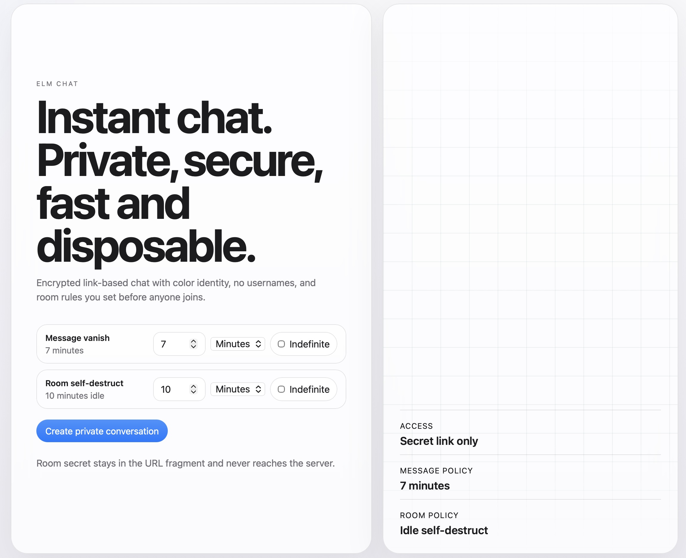
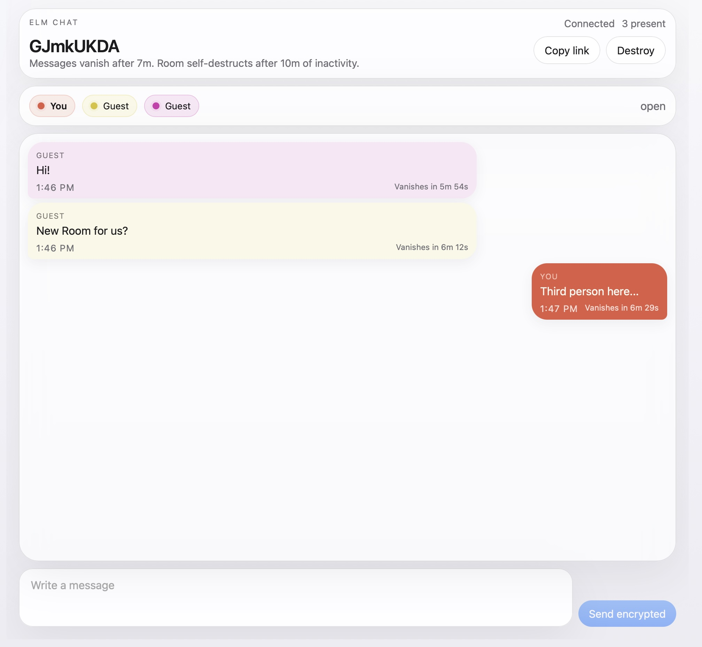

# Why Use elm.chat?

`elm.chat` is for conversations that should be easy to start, hard to collect, and easy to leave behind.

It is useful when you want:

- a private room without creating an account
- a secret link instead of a social profile
- messages that vanish
- rooms that self-destruct
- no usernames in the conversation
- less permanent exposure if something is later breached, copied, or inspected

## In Plain Language

Most chat apps are built to remember everything.

They keep history, profiles, device sync, archives, and metadata trails. That can be convenient, but it also means more information exists for longer in more places.

`elm.chat` takes the opposite approach.

It is designed for people who want to say something sensitive without turning that conversation into a long-lived record.

That might mean:

- discussing a personal matter
- sharing something confidential
- talking through a legal, financial, or medical situation
- reporting abuse or wrongdoing
- coordinating in an environment where surveillance is a real concern

## What Makes It Different

- Secret link only: access comes from the room link, not a public identity layer.
- Color identity: participants are identified by color, not usernames.
- Message vanish controls: set when messages disappear before anyone joins.
- Room self-destruct: set when an idle room dies automatically.
- End-to-end encryption goals: keep readable content away from the middle.
- Disposable mindset: rooms are meant to be temporary, not lifelong archives.

## Who It Is For

`elm.chat` is for privacy-minded people in everyday life.

It is also for people in situations where retained communication can become dangerous:

- journalists and sources
- organizers and activists
- workers documenting misconduct
- people in abusive or coercive situations
- communities under censorship or political pressure

## The Point

The point is simple:

Not every conversation should become a permanent database record.

If you want a room that starts fast, stays private, and disappears on purpose, `elm.chat` is trying to be that tool.

